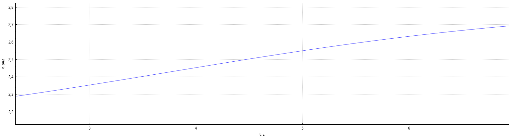
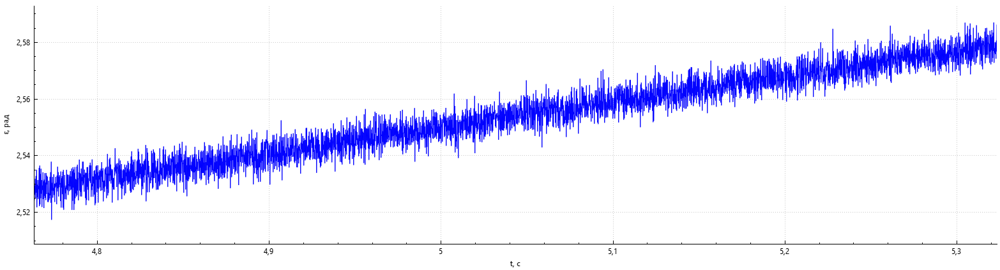

<h1>Наведение ЛА с моделью измерителя на цель</h1>
Модель ЛА описывается следующей системой уравнений:  

$$\left\{\begin{aligned}\frac{d\Theta}{dt}&=\frac{g}{V}(n_{y_a}-\cos{\Theta})\\  
\frac{dx}{dt}&=V\cos{\Theta}\\  
\frac{dy}{dt}&=V\sin{\Theta}\end{aligned}\right..$$
  
Цель описывается следующей системой:  

 $$\left\{\begin{aligned}\frac{dx_ц}{dt}=V_ц\cos{\Theta_ц}\\  
\frac{dy_ц}{dt}=V_ц\sin{\Theta_ц}\end{aligned}\right..$$  
  

 Модель измерителя заключается в накладывание шумов на величины $$r$$ и $$\varepsilon_ц$$. Шум моделируется с помощью алгоритма Бокса-Мюллера. Наложив шумы мы получаем измеренны значения $$r_{изм}$$ и $$\varepsilon_{ц~изм}$$:
  

$$r_{изм}=r+\sigma_r\xi_r~,$$  
$$\varepsilon_{ц~изм}=\varepsilon_ц+\sigma_\varepsilon\xi_\varepsilon~,$$
  

где $$\xi_{r,\varepsilon}$$ – белый шум с нулевым математическим ожиданием и единичной дисперсией; $$\sigma_{r,\varepsilon}$$ – значение дисперсии шумовой составляющей канала.

Ниже приведен пример сигнала канала измерителя без шума и с наложением шумов.
  

  
  

Полученный зашумлёный сигнал нельзя напрямую использовать в алгоритмах наведения. Для того чтобы измеренный зашумлённый сигнал можно было использовать его нужно сгладить или провести фильтрацию.

В данной программе реализованно сглаживание сигнала с помощью метода наименьших квадратов (МНК).

